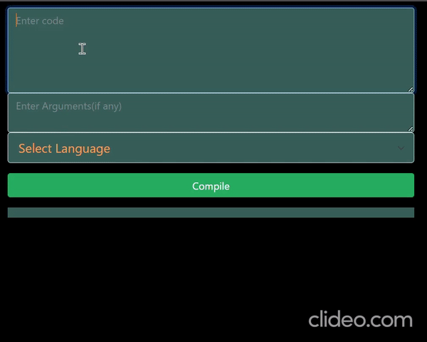

# Fast-Compiler
[](https://github.com/unownone/Fast-online-compiler/actions/workflows/docker-image.yml)

# Demo:
### [Hosted at DigitalOcean](http://139.59.52.61/)
<a href="https://youtu.be/eZSkH8Ox26k" title="Fast Compiler">
  <p align="center">
    
  </p>
</a>


## Compile code fast on the cloud! 

## Language Support Currently: 
- Python
- C++
- C
- Java
- More coming soon!

## API End Points:
- ```
    /api/getLangs
    ```
    - Type : ```GET```
    - Args : ```None```
    - Returns : ```list[strings]```

- ```
    /api/compile
    ```
    - Type : ```POST```
    - body :
        - lang : ```string``` 
        - code : ```string```
        - input : ```string``` [optional]
    - Returns : ```{ response: String }```

or

## [Use Front End](http://139.59.52.61/) : 
    at index : \


# Setup on Local:

## Using Docker :
``` 
    docker-compose up -d --build 
```
    Server will be running at localhost:80    
## Using VirtualEnv :
```
    virtualenv venv
    source venv/bin/activate
    pip install -r requirements.txt
    python wsgi.py
```
    Server will be running at localhost:5000
    
    - Set up languages for proper compilation/running

